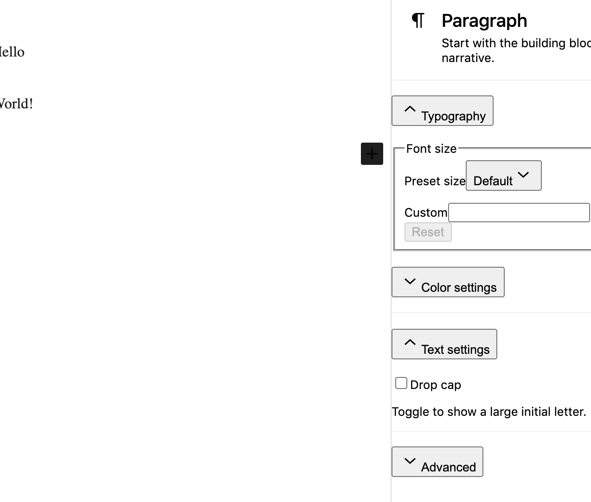

# NextJS + Parse Experiments

```
docker-compose up
```

This branch tries to stand up WordPress's Gutenberg editor on a new Next.js instance at http://localhost:3000/foo

The [Gutenberg Storybook](https://github.com/WordPress/gutenberg/blob/master/storybook/stories/playground/index.js) seems operable [here](https://wordpress.github.io/gutenberg/?path=/story/playground-block-editor--default), but numerous problems with my integration.



Latest Parse is operational (not locked down at all) on latest Typescript, Babel, and Postgres. Dashboard at: http://localhost:4040 (local/local). Currently nothing talking to Parse, yet.
